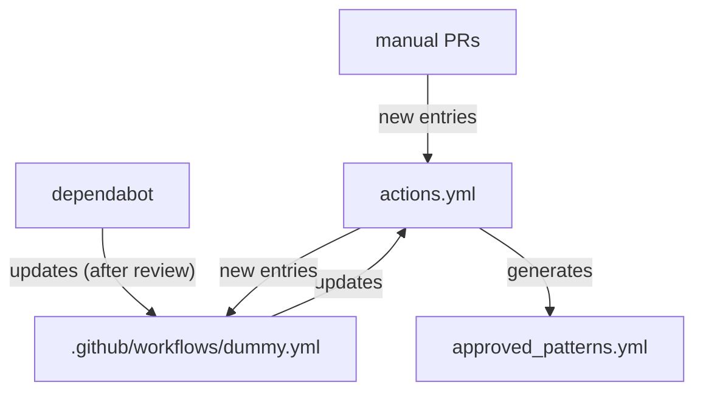

# ASF GitHub Actions Repository

This repository hosts GitHub Actions developed by the ASF community and approved for any ASF top level project to use. It also manages the organization wide allow list of Github Actions via 'Configuration as Code'.

- [Submitting an Action](#submitting-an-action)
- [Available GitHub Actions](#available-github-actions)
- [Organization-wide GitHub Actions Allow List](#management-of-organization-wide-github-actions-allow-list)
  - [Adding a New Action](#adding-a-new-action-to-the-allow-list)
  - [Adding a New Version](#adding-a-new-version-to-the-allow-list)
  - [Manual Version Addition](#manual-addition-of-specific-versions)
  - [Removing a Version](#removing-a-version-manually)

## Submitting an Action

To contribute a GitHub Action to this repository:

1. **Fork** this repository
2. **Add your action code**:
   - Create a subdirectory for your proposed GHA at the root level (e.g., `/MyNewAction`)
   - Add all required files for your action in this subdirectory
   - Include a comprehensive README.md that explains:
     - What the action does
     - Required inputs and available outputs
     - Example usage configurations
     - Any special considerations or limitations
3. **Create a pull request** to merge your branch into the main branch

The Infrastructure team will review each proposed Action based on:
- Overall usefulness to the ASF community
- Maintenance complexity
- Security considerations
- Code quality

Once approved, the Infrastructure team will merge the pull request and add the new Action to the list of available Actions for all ASF projects.

## Available GitHub Actions

  - [ASF Infrastructure Pelican Action](/pelican/README.md): Generate and publish project websites with GitHub Actions
  - [Stash Action](/stash/README.md): Manage large build caches

## Management of Organization-wide GitHub Actions Allow List

As stated in the [ASF GitHub Actions Policy](https://infra.apache.org/github-actions-policy.html), GitHub Actions from external sources are blocked by default in all `apache/*` repositories. Only actions from the following namespaces are automatically allowed:
- `apache/*`
- `github/*`
- `actions/*`

All other actions must be explicitly added to the allow list after undergoing a security review. This review process applies to both new actions and new versions of previously approved actions (though reviews for new versions are typically expedited).



### Adding a New Action to the Allow List

To request addition of an action to the allow list:

1. **Fork** this repository
2. **Add** an entry to `actions.yaml` using the following format:

```yaml
repo/owner:
  '<exact-commit-sha>':
    expires_at: 2050-01-01
```

3. **Create a PR** against the `main` branch
4. **Include in your PR description**:
   - Why this action is needed for your project
   - Any alternatives you've considered
   - Any security concerns you've identified

5. **Wait for review** by the infrastructure team

> [!NOTE]
> Always pin actions to exact commit SHAs, never use tags or branch references.

The infrastructure team will review your request and either approve, request changes, or provide feedback on alternatives.

### Adding a new _version_ to the allow list

In most cases, new versions are automatically added through Dependabot:
- Dependabot opens PRs to update actions to the newest releases
- The previously approved version will be marked to expire in 3 months
- This grace period gives projects sufficient time to update their workflows

### Manual Addition of Specific Versions

If you need to add a specific version of an already approved action (especially an older one):

1. **Fork** this repository
2. **Add** a new version entry to an existing action in `actions.yaml` with the following format:

```yaml
existing/action:
  '<exact-commit-sha>':
    expires_at: 2025-01-01
    keep: true
```

3. **Create a PR** against the `main` branch
4. **Include in your PR description**:
   - Specific reason why this version is required
   - Any blockers preventing upgrade to newer versions
   - Risk assessment for using an older version
   - Expected timeline for migration to newer versions (if applicable)

> [!WARNING]
> Older versions may contain security vulnerabilities or performance issues. Always evaluate if using the latest version is possible before requesting older versions.

### Removing a version manually

> [!IMPORTANT]
> If a version or entire action needs to be removed immediately due to a security vulnerability:

1. **Fork** this repository
2. **Remove** the relevant entry from `actions.yaml`
3. **Create a PR** against the `main` branch
4. **Mark it as urgent** in the PR title (e.g., "URGENT: Remove vulnerable action X")
5. **Include in your PR description**:
   - The reason for removal
   - Any CVE or security advisory ID if applicable
   - Impact on projects currently using the action
   - Recommended alternatives if available

The infrastructure team will prioritize these removal requests and may take additional steps to notify affected projects if necessary.
