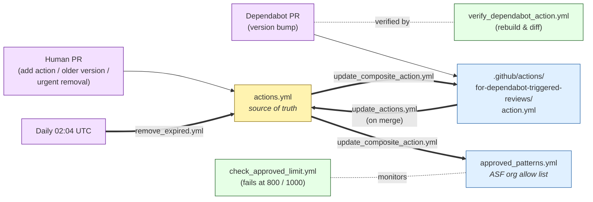
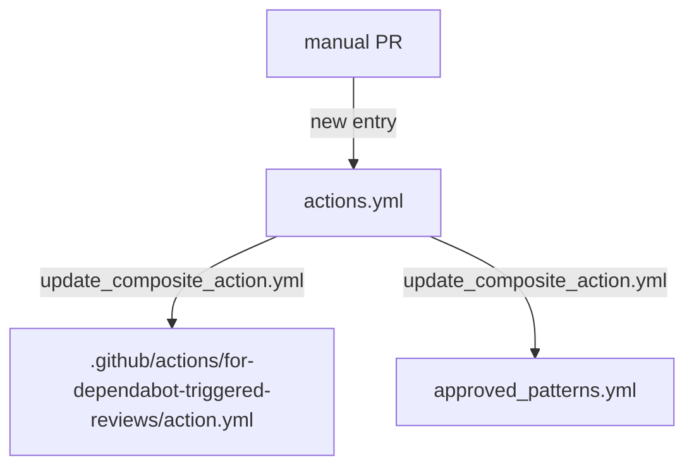
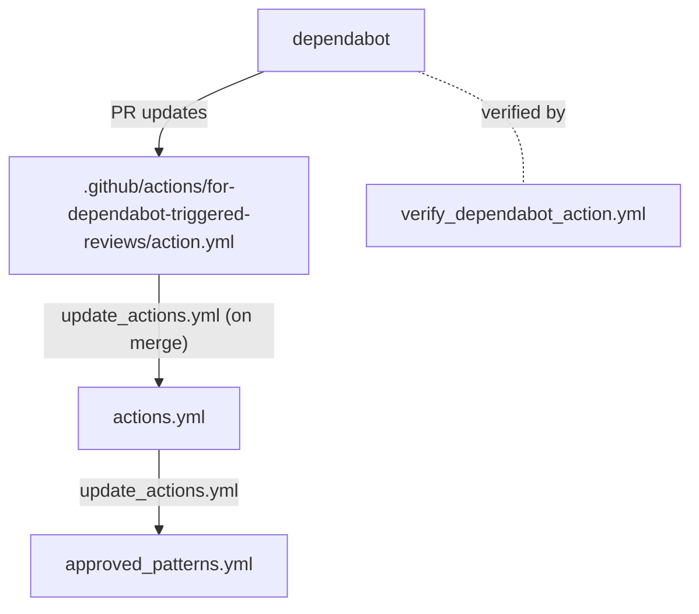
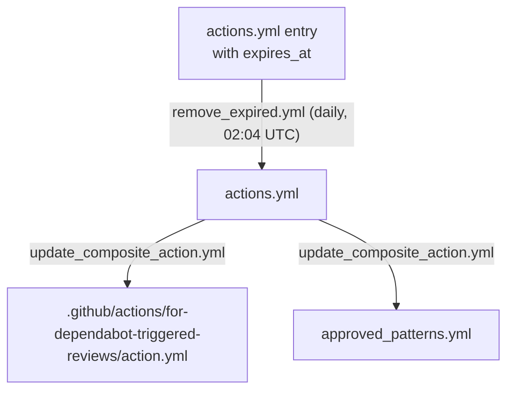

<!--
  Licensed to the Apache Software Foundation (ASF) under one
  or more contributor license agreements.  See the NOTICE file
  distributed with this work for additional information
  regarding copyright ownership.  The ASF licenses this file
  to you under the Apache License, Version 2.0 (the
  "License"); you may not use this file except in compliance
  with the License.  You may obtain a copy of the License at

   http://www.apache.org/licenses/LICENSE-2.0

  Unless required by applicable law or agreed to in writing,
  software distributed under the License is distributed on an
  "AS IS" BASIS, WITHOUT WARRANTIES OR CONDITIONS OF ANY
  KIND, either express or implied.  See the License for the
  specific language governing permissions and limitations
  under the License.
-->
# ASF GitHub Actions Repository

This repository hosts GitHub Actions developed by the ASF community and approved for any ASF top level project to use. It also manages the organization wide allow list of GitHub Actions via 'Configuration as Code'.

- [Submitting an Action](#submitting-an-action)
- [Available GitHub Actions](#available-github-actions)
- [Organization-wide GitHub Actions Allow List](#management-of-organization-wide-github-actions-allow-list)
  - [Pipeline Overview](#pipeline-overview)
  - [Adding a New Action](#adding-a-new-action-to-the-allow-list)
  - [Reviewing](#reviewing)
  - [Updating Version of Already Approved Action](#updating-version-of-already-approved-action)
    - [Automated Verification in CI](#automated-verification-in-ci)
    - [Dependabot Cooldown Period](#dependabot-cooldown-period)
  - [Manual Version Addition](#manual-addition-of-specific-versions)
  - [Automatic Expiration of Old Versions](#automatic-expiration-of-old-versions)
  - [Removing a Version](#removing-a-version-manually)
- [Auditing Repositories for Actions Security Tooling](#auditing-repositories-for-actions-security-tooling)

## Submitting an Action

To contribute a GitHub Action to this repository:

1. **Fork** this repository
2. **Add your action code**:
   - Create a subdirectory for your proposed GHA at the root level (e.g., `/MyNewAction`)
   - Add all required files for your action in this subdirectory
   - Include a comprehensive README.md that explains:
     - What the action does
     - Required inputs and available outputs
     - Example usage configurations
     - Any special considerations or limitations
3. **Create a pull request** to merge your branch into the main branch

## Reviewing

The Infrastructure team will review each proposed Action based on:
- Overall usefulness to the ASF community
- Maintenance complexity
- Security considerations
- Code quality

Once approved, the Infrastructure team will merge the pull request and add the new Action to the list of available Actions for all ASF projects.

We highly appreciate contributed reviews, especially from people
associated with the projects that (would like to) use a particular
action, even if they're not committers on _this_ project: you're
especially qualified to judge and vouch for the safety and
correctness of the action.

## Available GitHub Actions

  - [ASF Infrastructure Pelican Action](/pelican/README.md): Generate and publish project websites with GitHub Actions
  - [Stash Action](/stash/README.md): Manage large build caches
  - [ASF Allowlist Check](/allowlist-check/README.md): Verify workflow action refs are on the ASF allowlist

## Management of Organization-wide GitHub Actions Allow List

As stated in the [ASF GitHub Actions Policy](https://infra.apache.org/github-actions-policy.html), GitHub Actions from external sources are blocked by default in all `apache/*` repositories. Only actions from the following namespaces are automatically allowed:
- `apache/*`
- `github/*`
- `actions/*`

All other actions must be explicitly added to the allow list after undergoing a security review. This review process applies to both new actions and new versions of previously approved actions (though reviews for new versions are typically expedited).

`actions.yml` is the source of truth for approved actions. From it, two generated files are kept in sync automatically: `approved_patterns.yml` (consumed by the ASF org-wide allow list) and `.github/actions/for-dependabot-triggered-reviews/action.yml` (the composite action Dependabot watches, so it can propose version bumps). The sections below describe the two entry points — manual PRs to add a new action, and the Dependabot-driven flow for updating versions of already-approved actions — and the workflows that implement each.

#### Pipeline Overview

The diagram below summarizes every entry point, workflow and generated file involved in keeping the allow list in shape. Each subsequent section zooms in on one slice of this flow.


```mermaid
graph LR
    human["Human PR<br/>(add action / older version /<br/>urgent removal)"]
    dependabot["Dependabot PR<br/>(version bump)"]
    cron["Daily 02:04 UTC"]

    actions["actions.yml<br/><i>source of truth</i>"]
    composite[".github/actions/<br/>for-dependabot-triggered-reviews/<br/>action.yml"]
    approved["approved_patterns.yml<br/><i>ASF org allow list</i>"]

    human-->actions
    dependabot-->composite
    dependabot-.verified by.-verify["verify_dependabot_action.yml<br/>(rebuild &amp; diff)"]

    composite=="update_actions.yml<br/>(on merge)"==>actions
    cron=="remove_expired.yml"==>actions

    actions=="update_composite_action.yml"==>composite
    actions=="update_composite_action.yml"==>approved

    guard["check_approved_limit.yml<br/>(fails at 800 / 1000)"]-.monitors.-approved

    classDef source fill:#fff3b0,stroke:#8a6d0b,color:#333
    classDef generated fill:#e0f0ff,stroke:#2563a6,color:#333
    classDef trigger fill:#f3e0ff,stroke:#6a1b9a,color:#333
    classDef workflow fill:#e6ffe6,stroke:#1b5e20,color:#333
    class actions source
    class composite,approved generated
    class human,dependabot,cron trigger
    class verify,guard workflow
```

Solid arrows (`==>`) are workflow regeneration edges — the "source → generated" flows that keep `actions.yml`, `approved_patterns.yml` and the dependabot composite in sync. Thin arrows feed the pipeline with new content (human or Dependabot PRs, cron), and dotted arrows are observer workflows that verify or guard rather than mutate.

> [!NOTE]
> `check_approved_limit.yml` guards the whole pipeline: the org-wide allow list has a hard cap of 1000 entries, and this workflow fails at 800 to give maintainers room to clean up before hitting the wall.

### Adding a New Action to the Allow List


```mermaid
graph TD;
    manual["manual PR"]--new entry-->actions.yml
    actions.yml--"update_composite_action.yml"-->composite[".github/actions/for-dependabot-triggered-reviews/action.yml"]
    actions.yml--"update_composite_action.yml"-->approved["approved_patterns.yml"]
```

A human-authored PR edits `actions.yml` directly. Once it merges to `main`, the **`update_composite_action.yml`** workflow regenerates both `.github/actions/for-dependabot-triggered-reviews/action.yml` and `approved_patterns.yml` from the new entries, so contributors never have to hand-edit the generated files.

To request addition of an action to the allow list:

1. **Fork** this repository
2. **Add** an entry to `actions.yml` using the following format:

```yaml
repo/owner:
  '<exact-commit-sha>':
    tag: vX.Y.Z
```

3. **Create a PR** against the `main` branch
4. **Include in your PR description**:
   - Why this action is needed for your project
   - Any alternatives you've considered
   - Any security concerns you've identified

5. **Wait for review** by the infrastructure team

> [!NOTE]
> Always pin actions to exact commit SHAs, never use tags or branch references.

The infrastructure team will review your request and either approve, request changes, or provide feedback on alternatives.

### Updating version of already approved action


```mermaid
graph TD;
    dependabot--"PR updates"-->composite[".github/actions/for-dependabot-triggered-reviews/action.yml"]
    dependabot-.verified by.-verify["verify_dependabot_action.yml"]
    composite--"update_actions.yml (on merge)"-->actions.yml
    actions.yml--"update_actions.yml"-->approved["approved_patterns.yml"]
```

In most cases, new versions are automatically added through Dependabot:
- Dependabot opens PRs against `.github/actions/for-dependabot-triggered-reviews/action.yml` to update actions to the newest releases
- **`verify_dependabot_action.yml`** runs on each such PR, rebuilds the action's compiled JavaScript in Docker, and diffs it against the published version (see [Automated Verification in CI](#automated-verification-in-ci))
- Once a reviewer merges the PR, **`update_actions.yml`** reflects the new commit SHAs back into `actions.yml` and regenerates `approved_patterns.yml`
- The previously approved version is marked with an `expires_at` date 3 months out, giving projects a grace period to update their workflows; see [Automatic Expiration of Old Versions](#automatic-expiration-of-old-versions) for how the cleanup runs

Projects are encouraged to help review updates to actions they use. Please have a look at the diff and mention in your approval what you have checked and why you think the action is safe.

#### Verifying Compiled JavaScript

Many GitHub Actions ship pre-compiled JavaScript in their `dist/` directory. To verify that the published compiled JS matches a clean rebuild from source, use the verification script:

```bash
uv run utils/verify-action-build.py org/repo@commit_hash
```

For example:

```bash
uv run utils/verify-action-build.py dorny/test-reporter@dc3a92680fcc15842eef52e8c4606ea7ce6bd3f3
```

The script will:
1. Clone the action at the specified commit inside an isolated Docker container
2. Save the original `dist/` files as published in the repository
3. Rebuild the action from source, picking the right toolchain automatically — Node.js (`npm ci && npm run build`, `yarn`, or `pnpm`), Dart (`dart compile js` when a `pubspec.yaml` is present), or Deno (`deno task bundle` when a `deno.json`/`deno.jsonc` is present)
4. Reformat both versions of the JavaScript for readable comparison
5. Show a colored diff of any differences

A clean result confirms that the compiled JS was built from the declared source. Any differences will be flagged for manual inspection.

#### Security Review Checklist

When reviewing an action (new or updated), watch for these potential issues in the source diff between the approved and new versions:

- **Credential exfiltration**: code that reads secrets, tokens, or environment variables (e.g. `GITHUB_TOKEN`, `AWS_*`, `ACTIONS_RUNTIME_TOKEN`) and sends them to external endpoints via `fetch`, `http`, `net`, or shell commands (`curl`, `wget`).
- **Arbitrary code execution**: use of `eval()`, `new Function()`, `child_process.exec/spawn` with unsanitised inputs, or downloading and running scripts from remote URLs at build or runtime.
- **Unexpected network calls**: outbound requests to domains unrelated to the action's stated purpose, especially in `post` or cleanup steps that run after the main action.
- **Workflow permission escalation**: actions that request or rely on elevated permissions (`contents: write`, `id-token: write`, `packages: write`) beyond what their functionality requires.
- **Supply-chain risks**: new or changed dependencies in `package.json` that are unpopular, recently published, or have been involved in known compromises; mismatches between `package-lock.json` and `package.json`.
- **Obfuscated code**: hex-encoded strings, base64 blobs, or intentionally unreadable code in source files (not in compiled `dist/`).
- **File-system tampering**: writing to locations outside the workspace (`$GITHUB_WORKSPACE`), modifying `$GITHUB_ENV`, `$GITHUB_PATH`, or `$GITHUB_OUTPUT` in unexpected ways to influence subsequent workflow steps.
- **Compiled JS mismatch**: any unexplained diff between the published `dist/` and a clean rebuild — this is the primary check the verification script performs.

For the full approval policy and requirements, see the [ASF GitHub Actions Policy](https://infra.apache.org/github-actions-policy.html).

#### Batch-Reviewing Dependabot PRs

To review all open dependabot PRs at once, run:

```bash
uv run utils/verify-action-build.py --check-dependabot-prs
```

This will:
1. List all open PRs from dependabot
2. For each PR, extract the action reference from the diff
3. Run the full build verification (rebuild in Docker, compare compiled JS)
4. Show source changes between the previously approved version and the new one
5. If verification passes, ask whether to approve and merge the PR
6. On merge, add a review comment documenting what was verified

#### Running Without the `gh` CLI

If you prefer not to install the `gh` CLI, you can use `--no-gh` to make all GitHub API calls via Python `requests` instead. In this mode you must provide a GitHub token either via `--github-token` or the `GITHUB_TOKEN` environment variable:

```bash
# Using the flag:
uv run utils/verify-action-build.py --no-gh --github-token ghp_... org/repo@commit_hash

# Or via environment variable:
export GITHUB_TOKEN=ghp_...
uv run utils/verify-action-build.py --no-gh --check-dependabot-prs
```

The `--no-gh` mode supports all the same features as the default `gh`-based mode.

#### Automated Verification in CI

Two workflows in `.github/workflows/` run `verify-action-build` on PRs that touch the allow list, so the verification status is visible on every PR as a required-candidate status check:

- **`verify_dependabot_action.yml`** — triggers on Dependabot PRs that modify `.github/actions/for-dependabot-triggered-reviews/action.yml`. Extracts the action reference from the PR, rebuilds the compiled JavaScript in Docker, and compares it against the published version.
- **`verify_manual_action.yml`** — triggers on human-authored PRs that modify `actions.yml` or `approved_patterns.yml` (i.e. manual allow-list additions / version bumps). Dependabot-authored PRs are skipped, since they are already covered by the workflow above.

Both workflows use a regular `pull_request` trigger with read-only permissions and no PR comments — pass/fail is surfaced through the status check. Neither workflow auto-approves or merges; a human reviewer must still approve.

The script exits with code **1** (failure) when something is unexpectedly broken — for example, the action cannot be compiled, the rebuilt JavaScript is invalid, or required tools are missing. In all other cases it exits with code **0** and produces reviewable diffs: a large diff does not by itself cause an error (e.g. major version bumps will naturally have big diffs). It is always up to a human reviewer to inspect the output, assess the changes, and decide whether the update is safe to approve.

To verify a specific PR locally (non-interactively), use:

```bash
uv run utils/verify-action-build.py --ci --from-pr 123
```

The `--ci` flag skips all interactive prompts (auto-selects the newest approved version for diffing, auto-accepts exclusions, disables paging). The `--from-pr` flag extracts the action reference from the given PR number.

Additional flags:
- `--no-cache` — rebuild the Docker image from scratch without using the layer cache.
- `--show-build-steps` — display a summary of Docker build steps on successful builds (the summary is always shown on failure).

> [!NOTE]
> **Prerequisites:** `docker` and `uv`. When using the default mode (without `--no-gh`), `gh` (GitHub CLI, authenticated via `gh auth login`) is also required. The build runs in a `node:20-slim` container so no local Node.js installation is needed.

#### Dependabot Cooldown Period

This repository uses a [Dependabot cooldown period](https://docs.github.com/en/code-security/dependabot/dependabot-version-updates/configuration-options-for-the-dependabot.yml-file#cooldown) of 0 days so that maintainers can review before Dependabot opens a PR on project repositories.

> [!TIP]
> We recommend that ASF projects configure a cooldown in their own `dependabot.yml` to avoid being overwhelmed by update PRs and to catch up with approved actions here:
> ```yaml
> updates:
>   - package-ecosystem: "github-actions"
>     directory: "/"
>     schedule:
>       interval: "weekly"
>     cooldown:
>       default: 4
> ```
> Adjust the `default` value (in days) to match your project's review capacity.

### Manual Addition of Specific Versions

If you need to add a specific version of an already approved action (especially an older one):

1. **Fork** this repository
2. **Add** a new version entry to an existing action in `actions.yml` with the following format:

```yaml
existing/action:
  '<exact-commit-sha>':
    keep: true
    tag: vX.Y.Z
```

if this is the newest version of the action (make sure to remove the `keep: true` from the
previously newest version and add `expires_at: <date>` to it, if you want to set an expiration date for it),

or

```yaml
existing/action:
  '<exact-commit-sha>':
    expires_at: 2025-01-01
    tag: vX.Y.Z
```

If you add older version of the action and want to set an expiration date for it.


3. **Create a PR** against the `main` branch
4. **Include in your PR description**:
   - Specific reason why this version is required
   - Any blockers preventing upgrade to newer versions
   - Risk assessment for using an older version
   - Expected timeline for migration to newer versions (if applicable)

> [!WARNING]
> Older versions may contain security vulnerabilities or performance issues. Always evaluate if using the latest version is possible before requesting older versions.

### Automatic Expiration of Old Versions


```mermaid
graph TD;
    entry["actions.yml entry<br/>with expires_at"]--"remove_expired.yml (daily, 02:04 UTC)"-->actions.yml
    actions.yml--"update_composite_action.yml"-->composite[".github/actions/for-dependabot-triggered-reviews/action.yml"]
    actions.yml--"update_composite_action.yml"-->approved["approved_patterns.yml"]
```

Routine cleanup of superseded versions is automated:

- Any entry in `actions.yml` with an `expires_at: YYYY-MM-DD` field is a candidate for removal.
- Dependabot-driven updates (see [Updating Version of Already Approved Action](#updating-version-of-already-approved-action)) set `expires_at` to **3 months out** on the previously approved version. For manually added older versions, set `expires_at` explicitly (see [Manual Addition of Specific Versions](#manual-addition-of-specific-versions)).
- The **`remove_expired.yml`** workflow runs daily at **02:04 UTC**. Every entry whose `expires_at` date has passed is deleted from `actions.yml`; the workflow then commits the change and lets `update_composite_action.yml` regenerate `approved_patterns.yml` and the dependabot composite.
- Entries without `expires_at` (for example, `keep: true` wildcards and the current approved version) are never auto-removed — removal of those requires a manual PR.

No human action is required for the routine case: projects get a 3-month grace window after a version bump, and the old entry disappears on its own afterwards.

### Removing a version manually

Routine removal is already automated: set `expires_at` on the entry and the daily `remove_expired.yml` workflow will delete it once the date passes. Use the manual process below only when you need an immediate removal that can't wait for the entry to expire.

> [!IMPORTANT]
> If a version or entire action needs to be removed immediately due to a security vulnerability:

1. **Fork** this repository
2. **Remove** the relevant entry from `actions.yml`
3. **Create a PR** against the `main` branch
4. **Mark it as urgent** in the PR title (e.g., "URGENT: Remove vulnerable action X")
5. **Include in your PR description**:
   - The reason for removal
   - Any CVE or security advisory ID if applicable
   - Impact on projects currently using the action
   - Recommended alternatives if available

The infrastructure team will prioritize these removal requests and may take additional steps to notify affected projects if necessary.

For 'regular' removals (not security responses), you can use `./utils/action-usage.sh someorg/theaction` to see if/how an action is still used anywhere in the ASF, and create a 'regular' PR removing it from `actions.yml` (or adding an expiration date) when it is no longer used.

## Auditing Repositories for Actions Security Tooling

Recent security breaches have shown that GitHub Actions can fail silently, leaving repositories vulnerable without any visible indication. The `actions-audit.py` script helps ensure that all Apache repositories using GitHub Actions have a baseline set of security tooling in place.

### Why This Matters

GitHub Actions workflows can introduce security risks in several ways:
- **Unpinned or unreviewed action versions** may contain malicious code or vulnerabilities
- **Missing static analysis** means workflow misconfigurations (secret exposure, injection vulnerabilities) go undetected
- **No dependabot** means action versions never get updated, accumulating known vulnerabilities over time

The audit script checks each repository for four security configurations and can automatically open PRs to add any that are missing:

| Check | What it does |
|-------|-------------|
| **Dependabot** | Keeps GitHub Actions dependencies up to date with a 4-day cooldown to avoid overwhelming reviewers |
| **CodeQL** | Runs static analysis on workflow files to detect security issues in Actions syntax |
| **Zizmor** | Specialized scanner for GitHub Actions anti-patterns: credential leaks, injection vulnerabilities, excessive permissions |
| **ASF Allowlist Check** | Ensures every action used is on the ASF Infrastructure approved allowlist |

### Prerequisites

- **Python 3.11+** and [**uv**](https://docs.astral.sh/uv/) **>= 0.9.17** (dependencies are managed inline via PEP 723). Make sure your uv is up to date — depending on how you installed it, run `uv self update`, `pip install --upgrade uv`, `pipx upgrade uv`, or `brew upgrade uv`
- **`gh`** (GitHub CLI, authenticated via `gh auth login`) — or provide a `--github-token` with `repo` scope and use `--no-gh`
- **`zizmor`** ([install instructions](https://docs.zizmor.dev/installation/)) — required for PR creation mode; not needed for `--dry-run`. If missing, zizmor pre-checks are skipped with a warning

### Usage

Always start with `--dry-run` to see what the script would do without making any changes:

```bash
# Audit all repos for a specific PMC (prefix before first '-' in repo name)
uv run utils/actions-audit.py --dry-run --pmc spark --max-num 10

# Audit multiple PMCs
uv run utils/actions-audit.py --dry-run --pmc kafka --pmc flink

# Audit the first 50 repos (no PMC filter)
uv run utils/actions-audit.py --dry-run --max-num 50

# Increase GraphQL page size for fewer API round-trips
uv run utils/actions-audit.py --dry-run --max-num 200 --batch-size 100
```

When satisfied with the dry-run output, remove `--dry-run` to create PRs:

```bash
# Create PRs for spark repos missing security tooling
uv run utils/actions-audit.py --pmc spark --max-num 10
```

#### Options

| Flag | Description |
|------|-------------|
| `--pmc PMC` | Filter by PMC prefix (repeatable). The prefix is the text before the first `-` in the repo name, e.g. `spark` matches `spark`, `spark-connect-go`, `spark-docker`. |
| `--dry-run` | Report findings without creating PRs or branches. |
| `--max-num N` | Maximum number of repositories to check (0 = unlimited, default). |
| `--batch-size N` | Number of repos to fetch per GraphQL request (default: 50, max: 100). |
| `--github-token TOKEN` | GitHub token. Defaults to `GH_TOKEN` or `GITHUB_TOKEN` environment variable. |
| `--no-gh` | Use Python `requests` instead of the `gh` CLI for all API calls. Requires `--github-token` or a token env var. |

#### How PMC Filtering Works

The `--pmc` flag matches repos by prefix: the text before the first hyphen in the repository name. For example, `--pmc spark` matches `apache/spark`, `apache/spark-connect-go`, and `apache/spark-docker`. If the repo name has no hyphen, the full name is used as the prefix.

The script downloads the list of known PMCs from `whimsy.apache.org` on first run and caches it locally (`~/.cache/asf-actions-audit/pmc-list.json`) for 24 hours. If a `--pmc` value doesn't match any known PMC, a warning is printed but it is still used as a prefix filter.

#### What the PRs Contain

For each repository that is missing one or more checks, the script creates a single PR on a branch named `asf-actions-security-audit` containing only the missing files:

- `.github/dependabot.yml` — created or updated to include the `github-actions` ecosystem with a 4-day cooldown
- `.github/workflows/codeql-analysis.yml` — CodeQL scanning for the `actions` language
- `.github/workflows/zizmor.yml` — Zizmor scanning with SARIF upload
- `.github/workflows/allowlist-check.yml` — ASF allowlist verification on workflow changes

#### Zizmor Pre-Check

Before creating a PR, the script runs `zizmor` against the repository's existing workflow files. If zizmor finds errors, the **CodeQL and Zizmor workflow files are added but commented out**, with instructions explaining:
- That zizmor found existing issues in the workflows
- How to auto-fix common issues (`zizmor --fix .github/workflows/`)
- That the PMC should uncomment the workflows and fix remaining issues in a follow-up PR

This avoids creating PRs that would immediately fail CI due to pre-existing problems.

#### Interactive Confirmation

When not in `--dry-run` mode, the script prompts for confirmation before creating each PR:

```
  Create PR for apache/spark?
  Will add: dependabot, codeql, zizmor, allowlist-check
  Proceed? [yes/no/quit] (yes):
```

- **yes** (default) — create the PR
- **no** — skip this repository and continue to the next
- **quit** — stop processing entirely and print the summary

#### Idempotency

The script is safe to re-run. Before creating a PR for a repository, it checks whether a PR with the branch name `asf-actions-security-audit` already exists — open, closed, or merged — and skips the repo if so.
