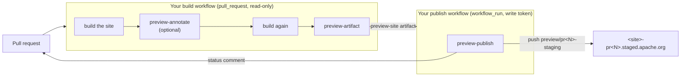

<!--
  Licensed to the Apache Software Foundation (ASF) under one
  or more contributor license agreements.  See the NOTICE file
  distributed with this work for additional information
  regarding copyright ownership.  The ASF licenses this file
  to you under the Apache License, Version 2.0 (the
  "License"); you may not use this file except in compliance
  with the License.  You may obtain a copy of the License at

   http://www.apache.org/licenses/LICENSE-2.0

  Unless required by applicable law or agreed to in writing,
  software distributed under the License is distributed on an
  "AS IS" BASIS, WITHOUT WARRANTIES OR CONDITIONS OF ANY
  KIND, either express or implied.  See the License for the
  specific language governing permissions and limitations
  under the License.
-->
# PR previews on ASF staging

Publish a live preview of a pull request's website at
`https://<site>-pr<N>.staged.apache.org/`, and let reviewers comment on it from
the page itself: drag a box over what you mean, and the preview copies a
captioned screenshot and opens the pull request — on the exact diff line that
produced that part of the page, when the site generator can tell us.

- [How it works](#how-it-works)
- [Quick start](#quick-start)
- [Choose your path](#choose-your-path) — Jekyll, Astro, Pelican, anything else
- [Using a preview](#using-a-preview)
- [The overlay on the published site](#the-overlay-on-the-published-site)
- [Lifecycle and retention](#lifecycle-and-retention)
- [Security model](#security-model)
- [Reference](#reference)
- [Development](#development)

## How it works

Three actions, split along the one boundary that matters: **the job that
builds pull-request code never holds a write token, and the job that holds a
write token never runs pull-request code.**



| Action | Runs in | Does |
|---|---|---|
| [`preview-annotate`](preview-annotate/action.yml) | your PR build | Switches on source annotation for your generator, so elements carry `data-preview-src="path:line"`. Optional. |
| [`preview-artifact`](preview-artifact/action.yml) | your PR build | Writes `preview-meta.json`, with the diff-line anchors, and uploads the built site as the `preview-site` artifact. |
| [`preview-publish`](preview-publish/action.yml) | a workflow that runs when the build completes | Publishes armed pull requests, retires the rest, keeps one status comment per PR up to date. |

A fourth, optional action, [`preview-main-overlay`](preview-main-overlay/action.yml),
puts the same review overlay on your published site; see
[below](#the-overlay-on-the-published-site).

Nothing is published until a committer asks for it: previews are **opt-in per
pull request**, with the `preview` label or a `/show-preview` comment.

## Quick start

A Jekyll site in `apache/foo-site`, built with `bundle exec jekyll build` into
`_site`. Replace each `<sha>` with the commit of the tag in the trailing
comment (see [Versioning](../README.md#versioning-and-pinning-actions)).

**1. Add the preview steps to your pull-request build**
(`.github/workflows/build.yml`):

```yaml
name: Build
on:
  pull_request:
  push:
    branches: [main]
permissions:
  contents: read
jobs:
  build:
    runs-on: ubuntu-latest
    permissions:
      contents: read
      pull-requests: read   # the PR's changed files, for the diff-line anchors
    steps:
      - uses: actions/checkout@3d3c42e5aac5ba805825da76410c181273ba90b1  # v7.0.1
        with:
          persist-credentials: false
      # ... set up Ruby the way you already do ...
      - name: Production build
        run: bundle exec jekyll build

      - name: Switch on source annotation
        if: github.event_name == 'pull_request'
        uses: apache/infrastructure-actions/pr-preview/preview-annotate@<sha>  # preview-annotate/v1.0.0
        with:
          generator: jekyll
          production-output: _site   # fails the build if the production output is annotated

      - name: Preview build
        if: github.event_name == 'pull_request'
        run: bundle exec jekyll build

      - name: Upload the preview
        if: github.event_name == 'pull_request'
        uses: apache/infrastructure-actions/pr-preview/preview-artifact@<sha>  # preview-artifact/v1.0.0
        with:
          path: _site
```

**2. Add a signal workflow** (`.github/workflows/preview-signal.yml`). Adding
or removing the label, or closing the PR, starts no build, but the publisher
still has to run. This workflow holds no permissions and runs nothing; its
completion is what triggers the publisher:

```yaml
name: Preview signal
on:
  pull_request:
    types: [opened, reopened, labeled, unlabeled, closed]
permissions: {}
jobs:
  signal:
    runs-on: ubuntu-latest
    timeout-minutes: 2
    steps:
      - run: echo "preview-publish.yml runs on this workflow's completion"
```

**3. Add the publisher** (`.github/workflows/preview-publish.yml`):

```yaml
name: Publish PR previews
on:
  # Runs this file from the default branch, never the PR's; see Security model.
  workflow_run:  # zizmor: ignore[dangerous-triggers] -- default-branch code, no PR input
    workflows: ["Build", "Preview signal"]   # the workflows' `name:`s
    types: [completed]
  issue_comment:        # a /show-preview comment publishes at once
    types: [created]
  workflow_dispatch:
    inputs:
      pr:
        description: "Arm and publish this PR number (blank: reconcile every PR)"
        required: false
        type: string
permissions: {}
jobs:
  publish:
    runs-on: ubuntu-latest
    timeout-minutes: 15
    permissions:
      contents: write        # push and delete preview/* branches
      pull-requests: write   # comment on and label pull requests
      issues: write          # create the label, react to /show-preview
      actions: read          # find and download the preview-site artifact
    concurrency:
      group: preview-publish
      cancel-in-progress: false
    steps:
      - uses: apache/infrastructure-actions/pr-preview/preview-publish@<sha>  # preview-publish/v1.0.0
        with:
          site-name: foo          # apache/foo-site stages at foo-pr<N>.staged.apache.org
          build-workflow: build.yml
          pr: ${{ inputs.pr }}
```

No checkout is needed: the publisher never looks at your repository's files.
It skips events it has nothing to do with (a comment on an issue, a
`workflow_run` from a push to `main`) and fails on any other trigger.

**4. Try it.** Open a pull request and add the `preview` label, or comment
`/show-preview` on it (you need write access; the bot adds the label and
reacts 🚀). Once the build is green the bot posts the preview URL; staging
takes a few more minutes to serve it.

## Choose your path

The build side is the only part that depends on your site generator. Pick the
row that matches your site; the publisher is identical for all of them.

| Your site | `preview-annotate` | What reviewers get | Notes |
|---|---|---|---|
| **Jekyll** | `generator: jekyll` | Diff line for Markdown blocks, layout and include tags | [Jekyll path](#jekyll) |
| **Astro** (React/JSX components) | `generator: astro` | Diff line for JSX elements | [Astro path](#astro) |
| **Pelican** (incl. the [ASF Pelican action](../pelican/README.md)) | `generator: none` or skip it | Screenshot + Conversation tab | [Pelican path](#pelican) |
| **Hugo, Sphinx, Docusaurus, MkDocs, plain HTML, anything static** | `generator: none` or skip it | Screenshot + Conversation tab | [Any other generator](#any-other-generator) |

Without annotation everything else still works — the preview, the overlay,
the captioned screenshot. Only the jump to the exact diff line is missing, and
the screenshot caption still records the page URL and commit.

### Jekyll

The [Quick start](#quick-start) is the Jekyll path. `preview-annotate`
installs a plugin into your site's `_plugins/` for the preview build only; no
Gemfile change. It stamps:

- **Markdown pages and collection documents** — headings, paragraphs, list
  items, tables, code blocks, blockquotes — from kramdown's source lines.
- **Layouts and includes** — every opening HTML tag, before Liquid runs.

Details, limits and the plugin's tests: [`adapters/jekyll/`](adapters/jekyll/README.md).

- Set `source:` if your site is not at the repository root.
- **Safe mode is not supported.** The `github-pages` gem forces
  `safe: true`, which ignores `_plugins`; the action refuses rather than
  producing a preview with nothing stamped. Use `generator: none` there.

### Astro

Astro builds through Vite, so annotation is a Babel plugin wired into the
React integration. Make `astro.config.mjs` pick it up when the action says so:

```js
integrations: [
  react(
    process.env.PREVIEW_ANNOTATE === "1"
      ? { babel: { plugins: [[process.env.PREVIEW_BABEL_PLUGIN, { root: process.cwd() }]] } }
      : {},
  ),
],
```

Then in the build workflow, pass the plugin to the preview build step:

```yaml
      - run: npm run build
      - if: github.event_name == 'pull_request'
        id: annotate
        uses: apache/infrastructure-actions/pr-preview/preview-annotate@<sha>  # preview-annotate/v1.0.0
        with:
          generator: astro
          production-output: dist
      - if: github.event_name == 'pull_request'
        env:
          PREVIEW_ANNOTATE: "1"
          PREVIEW_BABEL_PLUGIN: ${{ steps.annotate.outputs.babel-plugin }}
        run: npm run build
      - if: github.event_name == 'pull_request'
        uses: apache/infrastructure-actions/pr-preview/preview-artifact@<sha>  # preview-artifact/v1.0.0
        with:
          path: dist
```

Only `.tsx`/`.jsx` is stamped; `.astro` templates and Markdown content fall
back to the Conversation tab. See [`adapters/astro/`](adapters/astro/README.md).

### Pelican

There is no Pelican adapter yet, so skip `preview-annotate`. With the
[ASF Pelican action](../pelican/README.md), build without publishing on pull
requests and upload its output:

```yaml
      - uses: apache/infrastructure-actions/pelican@<sha>  # pelican/vX.Y.Z
        with:
          publish: ${{ github.event_name != 'pull_request' }}
          output: output
      - if: github.event_name == 'pull_request'
        uses: apache/infrastructure-actions/pr-preview/preview-artifact@<sha>  # preview-artifact/v1.0.0
        with:
          path: output
```

### Any other generator

Build as you normally do on `pull_request`, then call `preview-artifact` with
your output directory. That is the whole integration.

If your generator can emit attributes itself, you can add annotation without
an adapter: stamp any element with `data-preview-src="<repo-relative
path>:<line>"` in the **preview build only**. The overlay uses the nearest
stamped ancestor of the marked region, so partial coverage is fine.

## Using a preview

- **Arm it.** The `preview` label arms a pull request, when whoever added it
  last has write access. Three ways to put it there: add it directly; comment
  `/show-preview` — the whole comment, on its own line — and the bot adds it
  and reacts 🚀; or run the publish workflow by hand with `pr: <N>`, which
  adds it and publishes at once. The label is created on first use.
- **Follow it.** From then on every new head commit is republished the moment
  its build goes green. The bot keeps **one** status comment per pull request
  up to date (published / waiting on a build / refused / retired), and posts a
  new *Preview updated* comment on each publish, since an edit notifies nobody.
  Every preview comment leads with the preview URL.
- **Disarm it.** Remove the label. The preview is retired on the next run.
- **Review on it.** The page shows a banner naming the pull request, so a
  forwarded link is never mistaken for the live site. Press `c`, or pick
  *Comment on a region of this page* from the *Comment / Suggest a change*
  button, drag a box, and the preview copies a captioned screenshot and offers
  an **Open PR** button — to the Files tab on the source line when it was
  resolved, otherwise the Conversation tab. Paste into the comment box. If the
  page has its own `a.suggest-change` edit link, the overlay hides it and
  offers it from the same menu, so there is one button, not two.

## The overlay on the published site

`preview-main-overlay` injects the same overlay into the site built from your
default branch. There it shows no preview banner, and a comment opens a **new
issue** prefilled with the page URL, the source line on the branch, and the
commit — the screenshot is on the clipboard, ready to paste. Build the site
annotated, then inject before you publish:

```yaml
      - if: github.ref == 'refs/heads/main'
        uses: apache/infrastructure-actions/pr-preview/preview-annotate@<sha>  # preview-annotate/v1.0.0
        with:
          generator: jekyll
      - if: github.ref == 'refs/heads/main'
        run: bundle exec jekyll build
      - if: github.ref == 'refs/heads/main'
        uses: apache/infrastructure-actions/pr-preview/preview-main-overlay@<sha>  # preview-main-overlay/v1.0.0
        with:
          path: _site
```

This deliberately ships `data-preview-src` to the live site, so do not point
`preview-annotate`'s `production-output` check at this output. Pass
`generated:` for source trees that are not in this repository, such as pages
synced from elsewhere: their lines cannot be linked, so the issue carries only
the page.

## Lifecycle and retention

Everything this system creates is either replaced in place or removed by the
publisher; nothing accumulates per commit.

| Thing | Kept for | Removed when |
|---|---|---|
| `preview-site` artifact | `retention-days` (default **30**) | GitHub expires it. The publisher only needs the artifact for the PR's **current** head commit; an older one is never used again. If it expires before a preview is armed, the status comment says *waiting on a build* — re-run the build. |
| `preview/pr<N>-staging` branch | While the PR is open **and** armed | The PR closes or merges, or the label is removed. Each publish is a single force-pushed orphan commit, so the branch never grows history. |
| The staged site `<site>-pr<N>.staged.apache.org` | While the branch is live | **Never unstaged.** ASF staging keeps serving the last content after its branch is deleted. So retirement is two steps: first a **tombstone** — a one-page "this preview has been retired" notice with `robots.txt: Disallow: /` — is force-pushed over the preview, and only on the **next** run is the branch deleted. The hostname keeps serving the tombstone, never the pull request's code. |
| Status and how-to comments | The life of the pull request | Never deleted; edited in place, so each PR has at most one of each. |
| *Preview updated* and dispatch comments | The life of the pull request | Never deleted. One per publish, and one per arming by dispatch. |
| Your repository's head branches of closed PRs | Until the PR closes | Only with `reap-head-branches: "true"`: deleted once every PR from the branch is closed, and only if nobody pushed to it after. Protected, `main`, `publish`, `preview/*` and `asf-*` branches are never touched. |

Cost and noise:

- The publisher runs on events — a build or signal run completing, a PR
  comment, a dispatch — with no schedule, and exits quickly when nothing
  changed. An unchanged head is not republished. Every run reconciles every
  open PR, so a run that fails part-way is repaired by the next event, or by a
  dispatch with no PR number.
- Every preview push is a branch update, which ASF mirrors to your
  `commits@` list. Previews are opt-in per PR for exactly this reason.
- Staging content is `noindex`; `robots.txt` disallows everything.

## Security model

- **`preview-artifact` refuses anything but `pull_request`.** Under
  `pull_request_target` the build would run pull-request code while holding a
  privileged token.
- **`preview-publish` runs on `workflow_run`, `issue_comment` and
  `workflow_dispatch` only, never `pull_request_target`.** `workflow_run` and
  `issue_comment` run the workflow from the default branch, so pull-request
  code never gets near the write token. The events are signals: nothing is
  taken from them into the publisher, which re-derives everything from the
  API. It never checks out or executes repository code; it only downloads the
  artifact.
- **The publisher never reads pull-request content.** Every GitHub response
  passes through a projection in [`lib/github.mjs`](lib/github.mjs) first, so
  it learns only the PR number, label names, head SHA, author login and type,
  and a comment's body only when that is exactly `/show-preview` or
  bot-authored — never code, diff, title, description, branch name or commit
  messages. The diff-line anchors are computed by the unprivileged build and
  sanitised by the publisher. [`lib/boundary.test.mjs`](lib/boundary.test.mjs)
  enforces this with a full run against responses baited in every forbidden
  field, plus a fixed endpoint allowlist.
- **The artifact is untrusted input.** Before publishing, the publisher checks
  `preview-meta.json` against the pull request's real number and head commit,
  refuses archive entries with absolute or `..` paths and symlinks, and strips
  `.git`, `.gitignore` and `.gitmodules` from the tree.
- **The publisher writes `.asf.yaml` itself**, after copying the artifact, so
  a pull request can never ship a `publish:` block or another staging profile.
- **Arming is checked against actual repository permission.** The label counts
  only when whoever last added it has write access (triage can label without
  being a committer); a label with no visible `labeled` event counts as
  unarmed. A `/show-preview` counts only from a commenter with write access,
  and only when the comment is exactly the command.
- **Bot comments are edited only when authored by a bot and ending in the
  exact marker**, so nobody can plant a marker in a human comment to have it
  overwritten.
- **Tokens are redacted** from every git error before it can reach a log.

## Reference

### `preview-annotate`

| Input | Required | Default | Description |
|---|---|---|---|
| `generator` | yes | | `jekyll`, `astro` or `none` |
| `source` | no | `.` | Jekyll: the site source directory, holding `_config.yml` |
| `production-output` | no | | Fail if this directory already carries `data-preview-src` |

| Output | Description |
|---|---|
| `babel-plugin` | `astro` only: the Babel plugin's path, to pass to the preview build as `PREVIEW_BABEL_PLUGIN` |

### `preview-artifact`

| Input | Required | Default | Description |
|---|---|---|---|
| `path` | yes | | Directory holding the built preview site |
| `retention-days` | no | `30` | Days to keep the `preview-site` artifact |
| `token` | no | `github.token` | Reads the PR's changed files for the anchors; needs `pull-requests: read`. Without it the overlay links to the Conversation tab. |

### `preview-publish`

| Input | Required | Default | Description |
|---|---|---|---|
| `site-name` | yes | | First label of the staging hostname: `foo` for `foo-pr<N>.staged.apache.org` |
| `build-workflow` | no | `build.yml` | File name of the workflow that runs `preview-artifact` |
| `label` | no | `preview` | The label that arms a pull request |
| `pr` | no | | `workflow_dispatch` only: arm and publish this PR now |
| `reap-head-branches` | no | `false` | Also delete head branches of closed PRs |
| `token` | no | `github.token` | Needs `contents`, `pull-requests`, `issues` write and `actions` read |

### `preview-main-overlay`

| Input | Required | Default | Description |
|---|---|---|---|
| `path` | yes | | Directory holding the built, annotated site |
| `branch` | no | the default branch | Branch the site was built from; issue links point at its source lines |
| `generated` | no | | Source-path prefixes, one per line, whose files are not in this repository |

### The build contract

If you build the artifact without `preview-artifact`, this is what the
publisher expects: an artifact named `preview-site`, from a successful run of
`build-workflow` for the PR's head commit, holding the static site with
`preview-meta.json` at its root:

```json
{"pr": 123, "headSha": "<40-hex head commit>", "anchors": {}}
```

`anchors` is optional: `lib/write-meta.mjs` derives it from the PR's changed
files. The publisher treats it as untrusted and rebuilds each entry from its
path.

## Development

```sh
cd pr-preview
npm ci
npm test                                   # publisher, overlay, Astro adapter

export BUNDLE_GEMFILE=adapters/jekyll/test/Gemfile
bundle install
bundle exec ruby adapters/jekyll/test/preview_src_test.rb   # Jekyll adapter
```

CI runs both in [`pr-preview-test.yml`](../.github/workflows/pr-preview-test.yml),
plus an end-to-end run of `preview-annotate` and `preview-artifact` against
the Jekyll fixture site, `preview-main-overlay` against a small site, and a
check that `preview-publish` refuses a `pull_request` event.

| Path | What it is |
|---|---|
| `lib/` | The publisher (arming, planning, publishing, retiring, GitHub and git clients), the build's metadata writer and the main-site injector |
| `overlay/` | The review overlay injected into every published page |
| `adapters/` | Generator-specific source annotation |
| `vendor/html2canvas-pro/` | Screenshot library served with the overlay (MIT) |

Originally developed for the [Apache Magpie website](https://github.com/apache/magpie-site),
whose design notes cover the reasoning in more depth:
[preview deployments](https://github.com/apache/magpie-site/blob/main/docs/designs/2026-09-16-pr-preview-deployments-design.md),
[review overlay](https://github.com/apache/magpie-site/blob/main/docs/designs/2026-09-17-preview-review-overlay-design.md),
[Jekyll adapter](https://github.com/apache/magpie-site/blob/main/docs/designs/2026-09-27-preview-jekyll-adapter-design.md).
